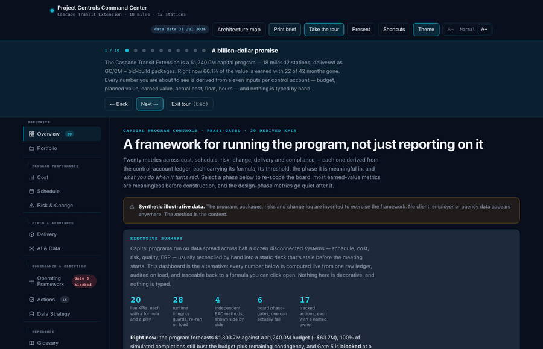
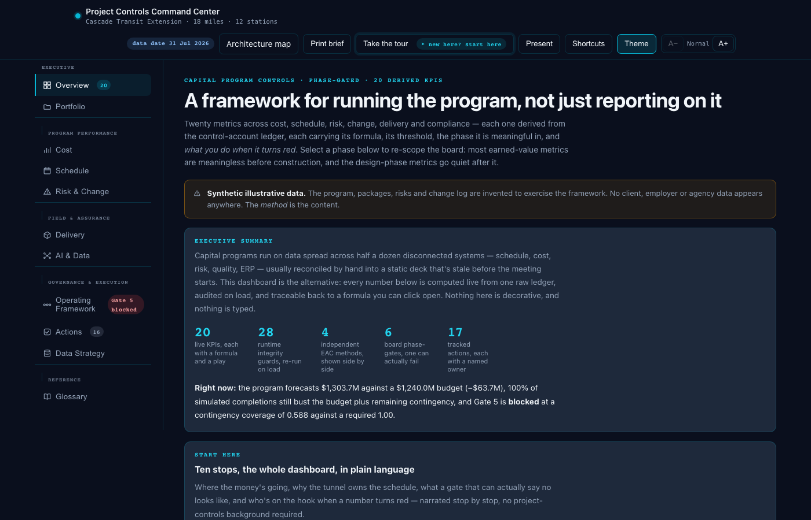
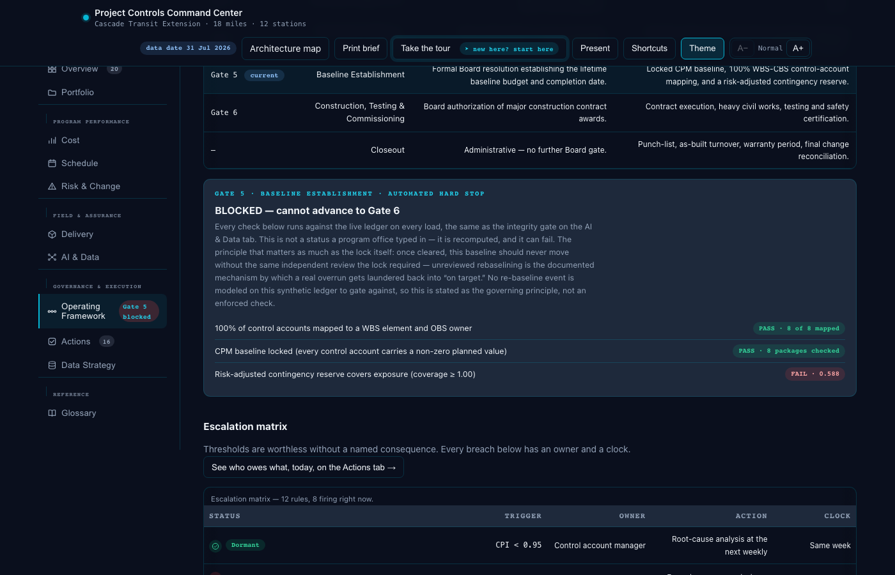

# Project Controls Command Center

A phase-gated operating framework for capital program controls — 20 derived KPIs across cost,
schedule, risk, change, delivery and compliance, each carrying its formula, threshold bands, the
phases it is meaningful in, and the play to run when it breaches. Built around a synthetic
multi-package capital transit program, plus a requirement-coverage fit brief.

**Live:** https://tjaiyen.github.io/project-controls-command-center/

**20 KPIs · 11 tabs · 1,846 tests passing · 64 independent SQL parity checks · zero dependencies**
— every number below is computed live from one 11-input ledger, never typed, and provably identical
whether re-derived in the browser's own JavaScript or an independent DuckDB/SQL pipeline.

<p align="center">
  
</p>

*The dashboard's own 10-stop guided Tour, narrated stop by stop — not a scripted demo recording,
the same "Take the tour" button and the same live numbers a visitor gets.*

<p>
  
  
</p>

*Left: the Overview board — a KPI is live if you can watch it change. Right: Gate 5, mid-lock — a
governance gate that always shows green isn't checking anything; this one just failed, live,
because it's actually computing the condition instead of asserting a status.*

## What's on each tab

11 tabs grouped into 5 altitudes on the rail — **Executive · Program Performance · Field &
Assurance · Governance & Execution · Reference**. Global chrome: a live "Gate 5 blocked" status
pill, a hover/focus-preview mini-drawer on every tab button (core question, real leading prose, a
live-computed system-of-record), a global 1&ndash;9 tab-jump with a "?" shortcuts overlay
gathering every shortcut on the page in one place, a sticky in-tab section-anchor rail on Cost and
Schedule, and a "return to origin tab" breadcrumb after any cross-tab jump.

<details>
<summary><b>Every tab, every feature named</b> (click to expand)</summary>

- **Overview** — a "Six lenses, not one blended score" card (why Cost/Schedule/Risk/Change/
  Delivery/Compliance can't be folded into one number), a "Three layers, not one number" card
  naming this dashboard's own leading-telemetry / confirming-EVM / independent-assurance
  architecture, a KPI board with drill-down detail including a live root-cause-to-owner trace and
  a float-specific companion panel linking the worst-float account to its real delay fragnet and
  crew-level idle-time split, an eleven-input ledger card with a per-package inspector and a live
  "change one input, watch the KPIs move" demo, a 10-stop guided Tour with tab-jumping evidence
  links, and a "Velocity Pulse" strip reading 5 real drift signals together for the first time —
  EAC velocity, float erosion rate, milestone slip, crew CPH EWMA gap, Non-Critical Progress
  Inflation — each pill jumping to its own tab.
- **Portfolio** — agency-level rollup across 4 lines of business, one read live off this program's
  own totals, three summary-only.
- **Cost** — EVM S-curve and variance bridge, an estimate-to-budget baseline bridge reconciled to
  the ledger, four-method EAC with a live divergence check flagging when methods disagree by more
  than ~5%, a forecast-reliability section (EAC trend, forecast-accuracy scorecard, monthly cash
  flow), what-if forecasting with scenario comparison, Monte Carlo completion distribution with a
  Triangular/PERT draw-shape toggle and a drag-to-inspect percentile needle, an AACE 57R-09
  risk-driver layer (opt-in toggles for each of the priced risk register's own named events,
  additive on top of the cost-efficiency draw — the canonical board-facing run provably untouched
  unless something is checked on), a flashing "100% Contingency Breach" pill, an Optimism Gap tile
  against the Flyvbjerg reference class (now also citing Flyvbjerg's own 0.5% "trifecta" —
  on-budget, on-schedule, and on-benefits, all three), a tri-point Beta-PERT curve playground with
  draggable/arrow-key-editable min/mode/max pins per control account, a canvas-based "Galton
  engine" replaying real simulated outcomes as falling beads at 1x/5x/instant/step-by-step speed,
  and a GBM/MLE cost-diffusion card — its honest "too thin to trust as a forecast" caveat leading
  the card on purpose, paired with a real strip plot of the 5 actual log-returns and the Gaussian
  shape MLE fits to them (centered on the sample mean, not the Itô-adjusted drift — a real
  distinction the chart gets right), a plain-language "Math unlocked" drift/volatility explainer,
  and an EVM-vs-GBM card comparing what each method *assumes* — never a forward-projected
  P80-completion figure, which the card itself explains was deliberately declined.
- **Schedule** — DCMA-style schedule health, named explicitly (SPI(t)/Earned Schedule, CPLI, BEI,
  float erosion — the objective metric triad the DCMA 14-Point Assessment and ANSI/EIA-748 sit
  under), a CPLI status-band summary strip alongside the per-package bars, a tracking Gantt with a
  per-account hover tooltip that works the CPLI formula live, a fragnet-based delay & TIA register
  tied to package float — including a real FS↔SS resequencing toggle on the one delay with an
  actual recovery story, switching between CP-101's original Finish-to-Start impact and its real,
  already-computed Start-to-Start recovered float — and revenue-service forecast drift.
- **Risk & Change** — a priced risk register, a contract commercial register (a third axis distinct
  from control accounts), and a change pipeline with proposed-vs-settled pricing defense.
- **Delivery** — leading indicators (productivity factor, RFI/submittal aging, a quality NCR
  register with real open counts and per-item aging) and a crew cost-per-hour module.
- **AI & Data** — pipeline architecture, the SQL model, a live 28-check integrity gate, a real SVG
  EWMA control chart with a dynamically widening control-limit band, a z-score control chart, and
  narrative generation under a verification contract.
- **Operating Framework** — a phase playbook, a WBS/CBS/OBS/ABS control-account mapping, Board
  phase-gate governance with a live Gate-5 hard stop, an escalation matrix, a live
  Working-Backward/inversion worked example, reporting cadence, a stakeholder interface map, and a
  KPI reference library.
- **Actions** — a RAID/CAPA register with proactive staleness detection and owner accountability
  rollup.
- **Glossary** — 55 terms with live worked examples, a click-driven inline "i" help icon next to
  jargon anywhere on the page, a 5-category domain filter (Cost & EVM, Schedule & CPM,
  Risk/Commercial & Governance, Field Telemetry & Quality, Data Strategy & Architecture — every
  term individually categorized, every count live-derived from the real array), a real "See it
  live" button on every card jumping straight to where that term is actually computed, and a bare
  "/" keyboard shortcut jumping to the search box — chosen specifically over Cmd/Ctrl+K because
  this file already refuses to hijack any browser-reserved shortcut.
- **Data Strategy** — a real-world plan for connecting scattered, multi-system data: staging
  architecture, a 4-tile IDS guardrail status grid with a live 2-check ingestion-validation panel,
  a discrepancy-resolution decision flow, a Category/Trigger/Routing error-recovery table, and a
  Dual-Stack Parity card citing this program's own real, live CPI against the actual SQL that
  independently re-derives it.
- **Motion** throughout (draw-in charts, staggered cards, growing histogram bars), with a
  `prefers-reduced-motion` guard.

</details>

## Companion pages & proof harnesses

| Page / path | What it is |
|---|---|
| [`architecture.html`](architecture.html) | A drawing-schedule-style map of the dashboard's own upstream→downstream data flow — six source systems through the ledger, KPI board, integrity gate, governance, to the three published outputs. A verified snapshot, not a live render |
| [`otak.html`](otak.html) | Fit brief: requirement-by-requirement coverage against a Project Controls Manager posting, gaps included. Re-verified against live req #3775557 on 17 Aug 2026 |
| [`pipeline/`](pipeline/) | The data layer made executable — `run_pipeline.py` synthesizes raw monthly claims deterministically, builds the ledger through `models/fct_control_account.sql` in DuckDB, enforces every guardrail declared in `models/schema.yml`, and proves the SQL output identical to the browser's JavaScript derivation (64 checks). The raw claim rows are synthesized to sum back to the dashboard's own real PV/EV/AC totals, so the proof covers the SQL aggregation/formula layer, not an independently-entered dataset. Requires `pip install duckdb` — no other dependencies |
| [`verify.cjs`](verify.cjs) | Tie-out harness — stubs the DOM, executes the dashboard's script, and independently re-derives every portfolio total (`node verify.cjs`) |
| [`stress.cjs`](stress.cjs) | Adversarial stress harness — 1,846 assertions across structure, runtime, simulated interactions (tabs, phases, filters, drawer, drill-down, what-if, scenarios, Monte Carlo, the risk-driver toggle, print brief, narrative generation, story walkthrough, glossary category filter + search (combined as AND) + "See it live" cross-tab jump, inline help popover, KPI root-cause drill-down, working-backward/inversion component, the Data Strategy tab, nav-rail keyboard navigation, tab-rail hover-preview drawers, the 1-9/"?" keyboard-shortcuts overlay, the altitude-grouped rail + Gate 5 pill, the in-tab anchor rail, the return breadcrumb, the D-04 FS/SS resequencing toggle, the CPLI status-band strip), module reconciliations (baseline bridge, change pricing, delay/float tie-out, WBS/contract/portfolio/forecast tie-outs), narrative-vs-data consistency, content-correctness checks (not just counts — e.g. a firing escalation must carry its own rule text, not a neighbor's), and the fabrication/sanitization sweeps (`node stress.cjs`) |

## Synthetic data

**The program, packages, milestones and risks are invented.** No client, employer, or agency data
appears anywhere in this repository. The methods are the content.

## How the numbers work

The ledger holds eleven inputs per control account — BAC, PV, EV, AC, commitments, total float,
remaining critical-path duration, baseline and completed activity counts, and earned versus actual
hours. Everything else is derived in the browser; nothing is a stored result:

```
SV  = EV − PV            schedule variance ($)
CV  = EV − AC            cost variance ($)
SPI = EV / PV            <1 behind schedule (in dollars, not days)
CPI = EV / AC            <1 over cost
EAC = BAC / CPI          forecast at completion at current efficiency (one of four methods shown)
VAC = BAC − EAC          forecast over/(under) run
TCPI = (BAC−EV)/(BAC−AC) efficiency the remaining work must hit to land on budget
CPLI = (cpRemaining + totalFloat) / cpRemaining   DCMA: <0.95 flagged
BEI  = activitiesDone / activitiesPlanned          DCMA: <0.95 flagged
PF   = earnedHours / actualHours                   leading indicator; moves before CPI
```

Portfolio EAC is rolled up **bottom-up** as the sum of package EACs, because each package is its own
control account with its own cost efficiency. The independent check — portfolio `BAC / CPI` — is
displayed alongside it. The two legitimately differ; a single blended CPI hides the spread between
packages, and that spread is what a program manager needs to see.

Current tie-out (verifiable in the browser console via `__PCC__.totals`, or with `node verify.cjs`):

| | |
|---|---|
| BAC | $1,240.0M |
| PV / EV / AC | $847.0M / $819.7M / $857.6M |
| SPI / CPI | 0.968 / 0.956 |
| EAC (bottom-up) | $1,303.7M |
| EAC (independent, BAC/CPI) | $1,297.3M |
| VAC | −$63.7M |
| TCPI (to BAC) | 1.099 |
| Complete | 66.1% |

## Stack

Static HTML. No build step, no framework, no dependencies, no CDN — each page is a single
self-contained file with inline CSS and one IIFE. Served directly by GitHub Pages from `main`.
Every chart is inline SVG except one: the Cost tab's Galton engine uses a single `<canvas>`
element, a deliberate call to introduce Canvas rather than draw thousands of individually
falling beads as DOM/SVG nodes — still zero external dependencies, just a second native
rendering technology alongside SVG.

Theming follows the same three-layer pattern as the rest of my work: `:root` dark default →
`@media (prefers-color-scheme: light)` → `:root[data-theme=…]` manual override.

## Related

- [Finance & data portfolio](https://tjaiyen.github.io/tj-finance-portfolio/) — dbt/DuckDB projects,
  Airflow orchestration, a guardrailed LLM finance agent
- [github.com/tjaiyen](https://github.com/tjaiyen)
